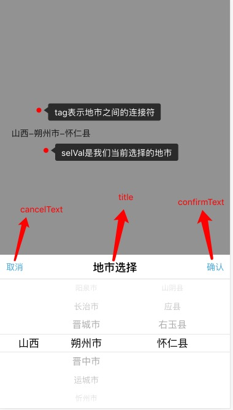

# ionic公用组件
>本项目基于基于angular1.5.3和ionic1.3.2进行开发
## 安装
### Step One
```
npm install xs-ionic-module --save
或者：
npm install https://github.com/xieshiCoder/xs-ionic-module.git --save
```
### Step Two
```
import xsIonicModule from 'xs-ionic-module';
```
### Step Three
```
在需要的模块中对组件进行依赖
例：
angular.module('app',[xsIonicModule.xsCityPicker,         //地市滚动选择组件
  xsIonicModule.xsImgPreview,         //图片视频展示组件
  xsIonicModule.xsImgSlide,           //图片全屏滑动展示组件
  xsIonicModule.xsImgLazyLoad])       //列表图片懒加载
```
## 使用

###1、地市滚动选择组件使用
>参数说明：  

       
```
核心代码：
<xs-city-picker tag='-' cancel-text='取消' confirm-text='确定' title='地市选择' sel-val='$myController.selVal'></xs-city-picker>

```


## License

ISC
